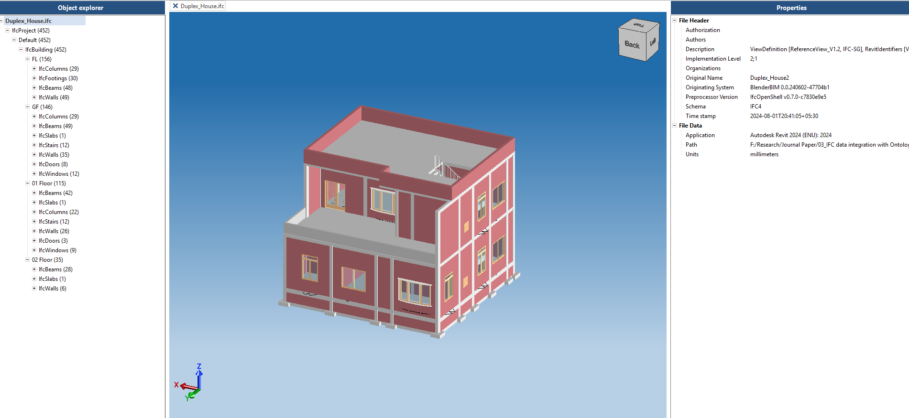
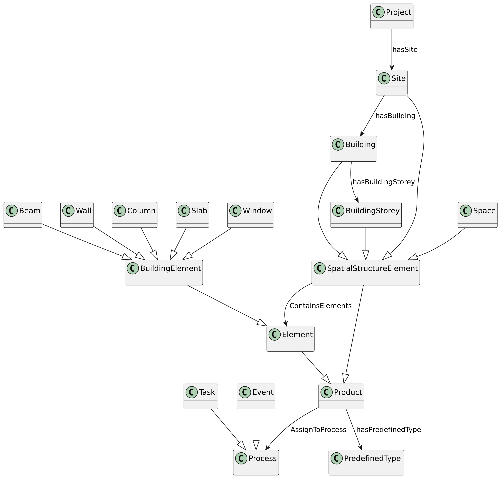
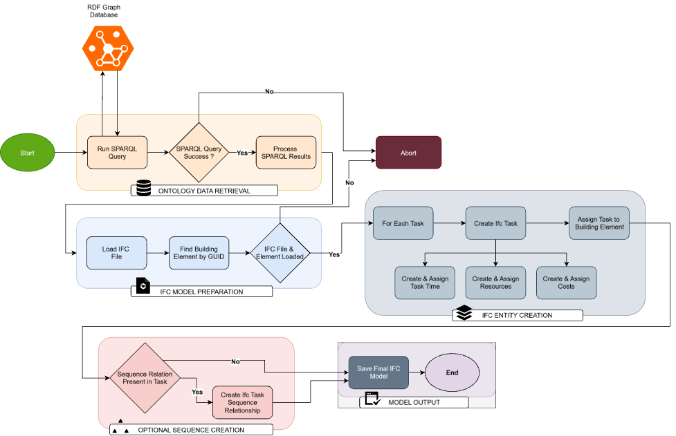

# Ontology-Driven Bi-Directional Workflow for BIM/IFC Integration

This repository contains the code and resources for the doctoral research project: "A Novel, Bi-directional Methodology for Integrating Project Management Data with the IFC Standard using Semantic Web Technologies."

## Abstract

The evolution of Building Information Modeling (BIM) towards a data-centric paradigm is often hindered by challenges in semantic interoperability, particularly when integrating project management data with the Industry Foundation Classes (IFC) standard. While IFC provides a robust schema for building geometry and properties, a persistent gap exists in dynamically linking this data with the complex, relational information of project schedules, resources, and costs in a standardized, interoperable manner.

This paper presents a novel, bi-directional methodology that leverages Semantic Web technologies to address this challenge. The core of the methodology is an ontology-driven workflow that uses two purpose-built ontologies: **BIMOnto**, a lightweight representation of the building asset derived from **ifcOWL**, and the **IproK (Integrated Project Knowledge Ontology)**, which formally structures process information.

In the primary workflow direction, data from a unified knowledge graph is retrieved via **SPARQL** queries and used to programmatically generate a new, enriched IFC model. This process moves beyond custom properties and instead creates native, standards-compliant IFC entities for tasks (**IfcTask**), resources (**IfcResource**), costs (**IfcCostItem**), and their standard relationships (**IfcRelAssignsToProduct**, etc.). The feasibility and effectiveness of this approach are validated through a case study, demonstrating the successful generation of a verifiable, integrated BIM artifact.

The findings show that this ontology-driven framework significantly enhances data integration, creating truly interoperable models where process data is a first-class citizen and advancing the potential for more intelligent, data-centric BIM practices.


---

## 🌊 Core Methodology & Workflow

The project's methodology is centered on a **two-ontology approach** to create a unified knowledge graph that separates building asset data from project process data.

1.  **BIMOnto:** A lightweight ontology derived from `ifcOWL` that represents the core building asset data (geometry, properties).
2.  **IproK Ontology:** A dedicated process ontology (`w3id.org/iprok/`) that structures project management information (tasks, schedules, costs, resources).

### Process Diagrams


**System Architecture (Fig 3):** This diagram illustrates the overall system architecture, including the data sources, the unified knowledge graph, and the integration components.


**Bi-Directional Workflow (Fig 9):** This diagram details the primary workflow for generating an enriched IFC file from the knowledge graph.


### Primary Workflow (KG-to-IFC)

1.  A unified knowledge graph is instantiated using data from both `BIMOnto` and `IproK`.
2.  Project Management data (from the [Iprok-web app](https://github.com/VenkateshKone-1/Iprok-web.git)) is integrated, linking tasks and resources to specific BIM elements.
3.  Targeted **SPARQL queries** are executed against the graph to retrieve integrated data (e.g., "find all tasks related to this wall" or "get the cost of all elements on Level 1").
4.  A Python script uses the `ifcopenshell` library to **programmatically generate a new IFC file**.
5.  Instead of using custom property sets, this script creates **native IFC entities** like `IfcTask`, `IfcResource`, and `IfcCostItem` and links them to products using standard relationships like `IfcRelAssignsToProduct`.
6.  The result is a fully standards-compliant, enriched IFC model that contains both geometry and project management data.

---

## 🛠️ Technology Stack

* **Core Language:** Python
* **Semantic Web:** Protégé, RDFlib, Owlready2, SPARQL
* **Ontologies:** **IproK**, **BIMOnto**, **ifcOWL**
* **BIM/IFC:** **ifcopenshell**
* **Graph Database (implied):** Apache Jena, GraphDB, or similar triple store for hosting the unified knowledge graph.

## 📂 Repository Structure


# Ontology-Driven Bi-Directional Workflow for BIM/IFC Integration

This repository contains the code and resources for the doctoral research project focused on creating a bi-directional workflow between a semantic project knowledge graph (the IproK ontology) and the IFC (Industry Foundation Classes) standard for BIM.

## 🎯 Project Goal

This project bridges the critical information gap between project management (PM) data and Building Information Models (BIM). Traditionally, PM data (schedules, costs, resources) and BIM data exist in separate, disconnected silos. This work creates a unified system where data can be integrated, enriched, and synchronized in both directions.

## ✨ Key Features

* **Bi-Directional Sync:** Not only reads from IFC, but *writes* enriched project data back to a new, standards-compliant IFC model.
* **Semantic Enrichment:** Uses the **IproK Ontology** (`w3id.org/iprok/`) to link PM data to specific BIM elements, creating a rich, queryable knowledge graph.
* **Standards-Based:** Ensures all generated models adhere to the buildingSMART IFC standard, guaranteeing interoperability.
* **Data Integrity:** Maintains data consistency across platforms, reducing errors and ambiguities.

## 🛠️ Technology Stack

* **Core Language:** Python
* **Ontology & Knowledge Graph:**
    * **IproK Ontology:** The custom-developed ontology for integrated project knowledge.
    * **Protégé:** Used for ontology development.
    * **Owlready2 / RDFlib:** For programmatically interacting with the ontology.
* **BIM & IFC:**
    * **ifcopenshell:** A crucial Python library for reading, parsing, and writing IFC files.
* **Database (Implied):** A graph database (like GraphDB or Neo4j) or a triple store (like Apache Jena) to host the knowledge graph.

## 🌊 High-Level Workflow

1.  **Parse IFC:** An initial IFC file is parsed using `ifcopenshell` to extract building elements (walls, slabs, rooms, etc.).
2.  **Populate Knowledge Graph:** This data is used to instantiate the IproK ontology, creating a baseline knowledge graph.
3.  **Integrate PM Data:** Project Management data (tasks, schedules, costs from the [Iprok-web app](https://github.com/VenkateshKone-1/Iprok-web.git)) is added to the knowledge graph and linked to the corresponding building elements.
4.  **Enrich & Infer:** SPARQL queries and semantic rules (SWRL) can be run on the graph to infer new knowledge (e.g., task dependencies, resource conflicts).
5.  **Generate New IFC:** A new, enriched IFC model is programmatically generated. This model now contains not just the geometry, but also the associated project management data, embedded as IFC properties and relationships.

## 🚀 Getting Started

*(This section can be filled in as you add code)*

### Prerequisites

* Python 3.9+
* `ifcopenshell`
* `owlready2`
* `rdflib`

### Installation

```bash
# Clone the repository
git clone [https://github.com/konevenkatesh/Semantic-BIM-Workflow.git](https://github.com/konevenkatesh/Semantic-BIM-Workflow.git)
cd Semantic-BIM-Workflow

# Install dependencies
pip install ifcopenshell owlready2 rdflib
